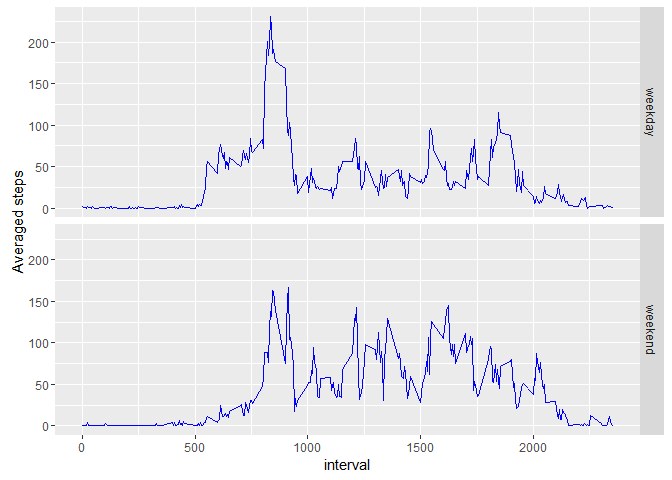

# Reproducible Research: Peer Assessment 1


## Loading and preprocessing the data

This part will unzip the file and load data into the R environment. The date variable was set to Date format for further analysis. Missing values were represented with NA.

1. Load the data (i.e. read.csv())

```r
library(dplyr)
```

```
## Warning: package 'dplyr' was built under R version 3.2.5
```

```
## 
## Attaching package: 'dplyr'
```

```
## The following objects are masked from 'package:stats':
## 
##     filter, lag
```

```
## The following objects are masked from 'package:base':
## 
##     intersect, setdiff, setequal, union
```

```r
library(ggplot2)

unzip("activity.zip", exdir = "./data")
activity <- read.csv("./data/activity.csv", na.strings = "NA", colClasses = c("integer", "character", "integer"))
```
2. Process/transform the data (if necessary) into a format suitable for your analysis

```r
str(activity)
```

```
## 'data.frame':	17568 obs. of  3 variables:
##  $ steps   : int  NA NA NA NA NA NA NA NA NA NA ...
##  $ date    : chr  "2012-10-01" "2012-10-01" "2012-10-01" "2012-10-01" ...
##  $ interval: int  0 5 10 15 20 25 30 35 40 45 ...
```

```r
activity$date <- as.Date(activity$date, format = "%Y-%m-%d")
class(activity$date)
```

```
## [1] "Date"
```

## What is mean total number of steps taken per day?

The total number for each day was calculated and all data throughout two months were visualized as a histogram. The mean and median value of total steps were calculated.

1. Calculate the total number of steps taken per day

```r
statistics <- activity %>%
    group_by(date) %>% 
    summarise(total = sum(steps, na.rm = TRUE)) %>% 
    data.frame()
statistics$date <- as.Date(statistics$date, "%Y-%m-%d")
```
2. If you do not understand the difference between a histogram and a barplot, research the difference between them. Make a histogram of the total number of steps taken each day

```r
g <- ggplot(statistics, aes(total))
g + geom_histogram(bins = 50) + labs(x = "Total steps", y = "Days")
```

<!-- -->
3. Calculate and report the mean and median of the total number of steps taken per day

```r
activity_mean <- mean(statistics$total)
activity_median <- median(statistics$total)
sprintf("The mean of total number of steps taken per day is %.2f, and the median is %d.", activity_mean, activity_median)
```

```
## [1] "The mean of total number of steps taken per day is 9354.23, and the median is 10395."
```

## What is the average daily activity pattern?

All the data were averagedacross all days to give a glance of activity pattern. The maximum activity occurred at about 8:30 in the morning.

1. Make a time series plot (i.e. type = "l") of the 5-minute interval (x-axis) and the average number of steps taken, averaged across all days (y-axis)

```r
averaged <- activity %>%
    group_by(interval) %>% 
    summarise(avgsteps = mean(steps, na.rm = TRUE)) %>%
    data.frame()
g <- ggplot(averaged, aes(x = interval, y = avgsteps))
g + geom_line() + labs(x = "Time interval", y = "Averaged steps")
```

<!-- -->
2. Which 5-minute interval, on average across all the days in the dataset, contains the maximum number of steps?

```r
maxval <- which(averaged$avgsteps == max(averaged$avgsteps))
sprintf("The 5-minute interval of %d contains maximum number of steps.", maxval)
```

```
## [1] "The 5-minute interval of 104 contains maximum number of steps."
```

## Imputing missing values

To find out if the missing values have impact on analysis, the missing values were replaced by mean value at the same 5-minute interval.

1. Calculate and report the total number of missing values in the dataset (i.e. the total number of rows with NAs)

```r
mval <- sum(is.na(activity$steps))
nall <- nrow(activity)
mrat <- mval/nall*100
sprintf("The number of missing values is %d out of %d, and the ratio of missing value is %.2f%%.", mval, nall, mrat)
```

```
## [1] "The number of missing values is 2304 out of 17568, and the ratio of missing value is 13.11%."
```
2. Devise a strategy for filling in all of the missing values in the dataset. The strategy does not need to be sophisticated. For example, you could use the mean/median for that day, or the mean for that 5-minute interval, etc.
3. Create a new dataset that is equal to the original dataset but with the missing data filled in.

```r
corrected <- activity
naindex <- which(is.na(corrected$steps))
for (i in naindex) {
    corrected[i,"steps"] <- averaged[which(averaged$interval == corrected$interval[i]),"avgsteps"]
}
```
4. Make a histogram of the total number of steps taken each day and Calculate and report the mean and median total number of steps taken per day. Do these values differ from the estimates from the first part of the assignment? What is the impact of imputing missing data on the estimates of the total daily number of steps?

```r
stat2 <- corrected %>%
    group_by(date) %>% 
    summarise(total = sum(steps, na.rm = TRUE)) %>% 
    data.frame()
stat2$date <- as.Date(stat2$date, "%Y-%m-%d")
g <- ggplot(stat2, aes(total))
g + geom_histogram(bins = 50) + labs(x = "Total steps", y = "Days")
```

<!-- -->

```r
activity_mean2 <- mean(stat2$total)
activity_median2 <- median(stat2$total)
sprintf("The mean of total number of steps taken per day is %.2f, and the median is %.2f.", activity_mean2, activity_median2)
```

```
## [1] "The mean of total number of steps taken per day is 10766.19, and the median is 10766.19."
```
The imputing missing data did have impacts for histogram. It decreased the days with minimum step number and increased the days with about 10000 steps. Both mean and median increased a little bit. Imputing missing data could reduce the bias of statistics.

## Are there differences in activity patterns between weekdays and weekends?

The data was separated by weekday or weekend. It turned out that the overall activity during daytime were higher in the weekends, while maximum activity in the morning dropped down in the weekends.

1. Create a new factor variable in the dataset with two levels - "weekday" and "weekend" indicating whether a given date is a weekday or weekend day.

```r
corrected$weekday <- weekdays(corrected$date)
corrected$weekday <- factor(corrected$weekday %in% c("Saturday", "Sunday"), labels = c("weekday", "weekend"))
```
2. Make a panel plot containing a time series plot (i.e. type = "l") of the 5-minute interval (x-axis) and the average number of steps taken, averaged across all weekday days or weekend days (y-axis). See the README file in the GitHub repository to see an example of what this plot should look like using simulated data.

```r
allweekdays <- filter(corrected, weekday == "weekday")
allweekends <- filter(corrected, weekday == "weekend")
avgweekdays <- allweekdays %>%
    group_by(interval) %>%
    summarise(mean = mean(steps, na.rm = TRUE)) %>%
    data.frame() %>%
    mutate(weekday = "weekday")
avgweekends <- allweekends %>%
    group_by(interval) %>%
    summarise(mean = mean(steps, na.rm = TRUE)) %>%
    data.frame() %>%
    mutate(weekday = "weekend")
allavg <- rbind(avgweekdays, avgweekends)
g <- ggplot(allavg, aes(x = interval, y = mean))
g + geom_line(color = "blue") + facet_grid(weekday~.) + labs(x = "interval", y = "Averaged steps")
```

<!-- -->
